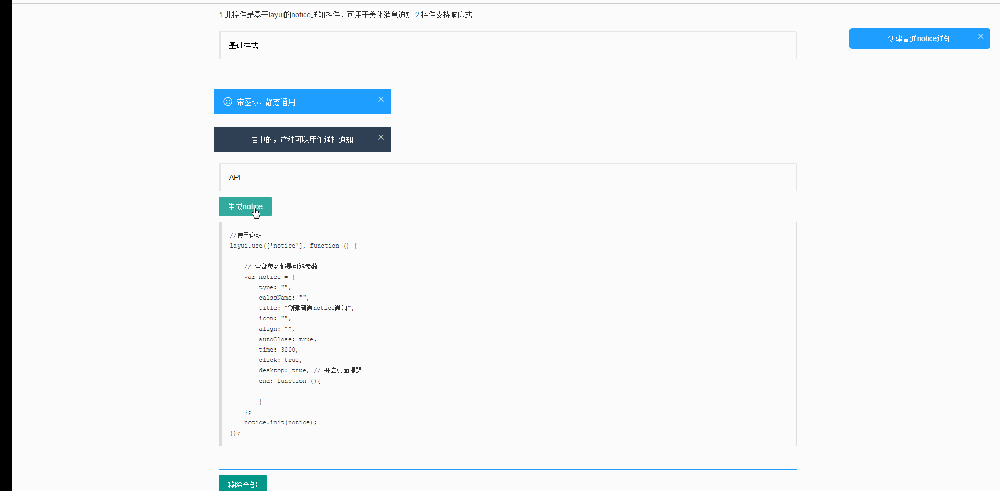

# 基于laNOui的notice通知控件

#### 项目介绍

##### 更新日志
- 2018年9月18日
 - **感谢layui社区成员@Thans修改了本插件**
 - 优化显示位置，改到右侧。（@Thans）
 - 可以同时显示多条通知（@Thans）
 - css代码初始化载入，不独立文件。（@Thans）
 - 在Thans修改版本上增加桌面提醒

基于layui的notice通知控件,算是对layer的一个小扩展

列示：


#### 使用说明

1. 配置layui扩展

```javascript
    layui.config({
        base: './../dist/'
    });
```

3. 调用API

```javascript
layui.use(['notice'], function () {
    notice.init({
        autoClose: true,
        title: "创建普通notice通知"
    });
});
```

参数配置，所有参数都为非传参数

| 参数名    | 必传    |  备注  |
| -------- | -----:   | :----: |
| type  | NO    |   主题类型，可选warm,danger,custom,default,默认default   |
| className  | NO |  类型为custom时，自定义样式Class名称   |
| title  | NO     |    notice内容   |
| icon  | NO |  图标，支持所有layui内置图标   |
| align  | NO     |   内容显示位置，可选left，right，center。默认居中center    |
| autoClose | NO  |  开启自动移除，默认true   |
| time  | NO |  自动移除时间，默认3000   |
| click  | NO     |   是否允许点击移除，默认true    |
| desktop  | NO     |   是否允许点击移除，默认false    |
| end | NO  |  生成完成回调函数   |

4. 支持方法

| 参数名    |   备注  
| -------- | :----: 
| init()  | 生成notice   |     
| close()  | 关闭上一个生成的notice |    
| closeAll()  | 关闭所有notice，包括页面静态内容     |    

```javascript
layui.use(['notice'], function () {
    notice.init();

    notice.close();

    notice.closeAll();
});
```

#### 参与贡献

1. Fork 本项目
2. 新建 Feat_xxx 分支
3. 提交代码
4. 新建 Pull Request


